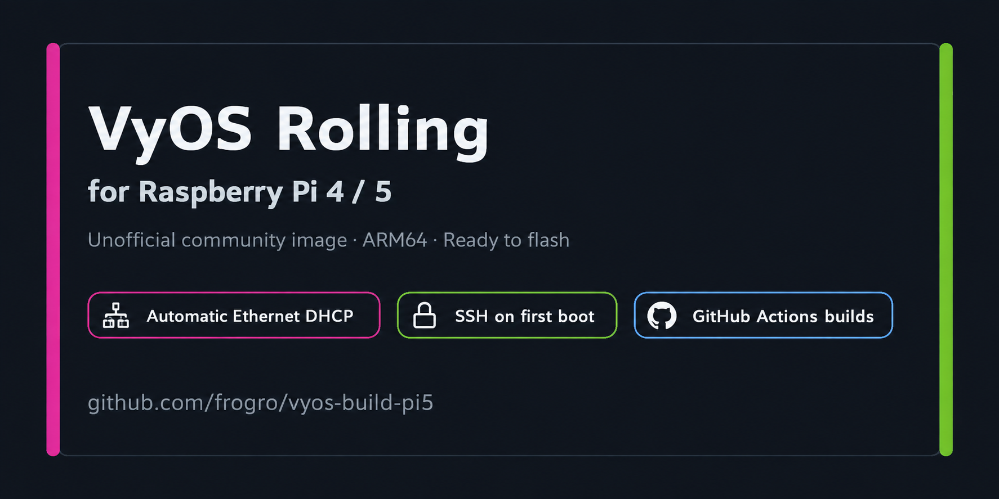

# VyOS for Raspberry Pi 4 / Raspberry Pi 5

> Unofficial community build of **VyOS Rolling ARM64** for the **Raspberry Pi 4 and Raspberry Pi 5**.

[](https://github.com/frogro/vyos-build-pi5/releases)
[](https://github.com/frogro/vyos-build-pi5/releases)
[](https://github.com/frogro/vyos-build-pi5/actions/workflows/build-vyos-pi5.yml)
[](https://paypal.me/FGrootens)

<p align="center">
  
</p>

## Table of Contents

- [Features](#features)
- [Quick Start](#quick-start)
- [First Boot and Login](#first-boot-and-login)
- [A/B System Updates](#ab-system-updates)
- [Optional Helper Scripts](#optional-helper-scripts)
- [Supported Hardware](#supported-hardware)
- [Build from Source](#build-from-source)
- [Build Design](#build-design)
- [Releases](#releases)
- [Changelog](CHANGELOG.md)
- [Contributing](CONTRIBUTING.md)
- [Security](SECURITY.md)
- [License and Trademarks](#license-and-trademarks)
- [Support the Project](#️-support-the-project)

This repository provides an unofficial VyOS image for Raspberry Pi 4 and Raspberry Pi 5 by combining:

- the VyOS Rolling ARM64 userspace and configuration system;
- an Armbian Raspberry Pi kernel, firmware, modules, Device Trees, overlays, and boot environment;
- Raspberry Pi-specific first-boot networking helpers.

**Upstream attribution:** VyOS provides the routing userspace and configuration framework; Armbian provides the Raspberry Pi-compatible Linux kernel, modules, firmware, Device Trees, overlays, and boot integration; Raspberry Pi Ltd. designs and documents the Raspberry Pi hardware.

> [!WARNING]
> This is an independent community project built from components provided by the **VyOS**, **Armbian**, and **Raspberry Pi** ecosystems. It is not produced, supported, sponsored, certified, or endorsed by the VyOS project, Sentrium S.L., Armbian, Armbian d.o.o., Raspberry Pi Ltd., or the Raspberry Pi Foundation. Rolling releases may contain regressions and should be tested before production use.

## Features

- Raspberry Pi 4 and Raspberry Pi 5 ARM64 image target
- Raspberry Pi boot through the pinned Armbian hardware base
- Raspberry Pi Linux kernel, Device Trees, overlays, modules, and firmware
- Automatic wired WAN setup on first boot:
  - automatic physical Ethernet interface detection
  - DHCP on the detected Ethernet interface
  - preferred wired default route
  - SSH enabled
  - verification that the DHCP address and default route remain active
- Optional wireless access point, DHCP server, DNS forwarding, and NAT
- Optional LTE/5G modem support
- Ready-to-flash compressed images published through GitHub Releases

The first-boot Ethernet setup starts after VyOS has completed its normal boot configuration. It saves Ethernet and SSH settings to `/config/config.boot`, starts the persistent VyOS DHCP client, verifies IPv4 connectivity and the default route, verifies that SSH is listening, and disables its own first-boot timer after success.

---

## Quick Start

### 1. Download the ready-to-use image

Open the [Releases page](https://github.com/frogro/vyos-build-pi5/releases) and download:

```text
vyos-pi5-fresh.img.xz
SHA256SUMS
```

The current filename retains the historical `pi5` project name. The image is intended for the Raspberry Pi 4 / Raspberry Pi 5 build target.

Verify the download on Linux:

```bash
sha256sum -c SHA256SUMS
```

Use a target drive larger than the uncompressed image. An 8 GB or larger SD card, USB drive, or supported SSD is recommended.

### 2. Flash with balenaEtcher

[balenaEtcher](https://etcher.balena.io/) is available for Linux, Windows, and macOS.

1. Start balenaEtcher.
2. Select `vyos-pi5-fresh.img.xz` directly.
3. Select the SD card, SSD, or USB drive.
4. Click **Flash**.
5. Wait for flashing and verification to finish.

> [!CAUTION]
> Flashing destroys all data on the selected target drive. Verify the destination carefully.

### 3. Flash from Linux with `dd`

Replace `/dev/sdX` with the complete target device, not a partition such as `/dev/sdX1`.

#### Option A: write the compressed image directly

```bash
sudo umount /dev/sdX?* 2>/dev/null || true
xz -dc vyos-pi5-fresh.img.xz | sudo dd of=/dev/sdX bs=4M status=progress conv=fsync
sync
sudo eject /dev/sdX
```

#### Option B: extract first, then write

This may be faster on slower systems because decompression and writing do not occur simultaneously.

```bash
xz -dk vyos-pi5-fresh.img.xz
sudo umount /dev/sdX?* 2>/dev/null || true
sudo dd if=vyos-pi5-fresh.img of=/dev/sdX bs=4M status=progress conv=fsync
sync
sudo eject /dev/sdX
```

---

## First Boot and Login

1. Connect the Raspberry Pi Ethernet port to a network that provides DHCP.
2. Insert or attach the flashed boot drive.
3. Power on the Raspberry Pi 4 or Raspberry Pi 5.
4. Allow approximately 60–90 seconds for first-boot configuration.
5. Find the assigned address in your router or DHCP server.
6. Connect over SSH.

Default credentials for this image:

```text
Username: vyos
Password: vyos
```

Example:

```bash
ssh vyos@192.168.1.100
```

Replace the example address with the address assigned to your Raspberry Pi.

> [!IMPORTANT]
> Change the default password immediately after the first login. For stronger security, configure SSH key authentication and stop using password-based login.

Change the password:

```text
configure
set system login user vyos authentication plaintext-password 'YOUR_NEW_PASSWORD'
commit
save
exit
```

Check which Ethernet interface was selected during first boot:

```bash
cat /config/.dhcp-wan-interface
```

Check Ethernet locally from the HDMI or serial console:

```bash
IFACE="$(cat /config/.dhcp-wan-interface)"
ip -4 -br addr show "$IFACE"
```

<details>
<summary><strong>First-boot diagnostics</strong></summary>

```bash
cat /config/dhcp-wan-firstboot-wrapper.log
cat /config/dhcp-wan-ssh-setup.log
IFACE="$(cat /config/.dhcp-wan-interface)"
systemctl status "dhclient@${IFACE}.service" --no-pager -l
```

The first-boot marker is:

```text
/config/.dhcp-wan-ssh-firstboot-done
```

</details>

---

## A/B System Updates

Current production images use two boot/root slots: A and B. Updates are written only to the inactive slot, while the currently running/default slot remains untouched as the rollback image.

Check the current slot state:

```bash
sudo /usr/libexec/vyos/vyos-pi-ab-status.py
```

Fresh images are preconfigured to use this repository's `rolling/version.json` metadata for the latest Raspberry Pi A/B release. Install the latest published update with:

```text
add system image latest
```

Local `.tar.zst` bundles and direct HTTP(S) bundle URLs are supported as well. The installer verifies the bundle manifest and SHA-256 hashes before it offers to write the inactive slot.

After an update has been written, test the new slot exactly once with:

```bash
sudo reboot '0 tryboot'
```

The automatic A/B guard arms the Raspberry Pi hardware watchdog, runs the health check, and commits the new slot as default only if the test boot is healthy. A failed or hung test boot leaves the previous default slot available for rollback.

> [!IMPORTANT]
> A new update is accepted only from a normal/default boot. After a successful `tryboot` has been committed by the automatic guard, perform one normal `sudo reboot` before installing another update. During the original test boot the Device Tree still reports `tryboot=1`, even after the new slot has been committed. Keeping this safety gate prevents the previous known-good rollback slot from being overwritten before the new default slot has also completed a normal boot.

If `add system image latest` cannot resolve an update URL, verify the configured metadata source:

```text
show configuration commands | grep 'system update-check'
```

The expected production setting is:

```text
set system update-check url 'https://raw.githubusercontent.com/frogro/vyos-build-pi5/rolling/version.json'
```

---

## Optional Helper Scripts

The image includes helper scripts in `/home/vyos`.

### Configure a wireless access point

```bash
/home/vyos/ap-dhcp-wan-setup.sh
```

This is separate from the automatic wired DHCP and SSH setup. Run it only when an access point, DHCP server, DNS forwarding, and NAT are required.

### Configure a modem

```bash
sudo /home/vyos/modem-connect.sh
```

Modem support depends on the modem, transport, drivers, firmware, carrier, and APN.

---

## Supported Hardware

### Wi-Fi adapters

`ap-dhcp-wan-setup.sh` does not hard-code a specific chipset. It enumerates every `phy` under `/sys/class/ieee80211`, reads supported interface modes from the kernel with `iw phy <phy> info`, and only offers devices that report AP mode support.

#### Known working hardware

- Raspberry Pi 5 onboard Broadcom BCM43455 / `brcmfmac`: verified as a 2.4 GHz / 802.11n and 5 GHz / 802.11ac / 80 MHz WPA2 access point, including DHCP, NAT, and client Internet access

#### Expected to work

- Raspberry Pi 4 onboard Broadcom Wi-Fi with compatible kernel and firmware
- MediaTek MT7921-class M.2/PCIe Wi-Fi 6 adapters
- Realtek RTL8852-class M.2/PCIe Wi-Fi 6 adapters
- MediaTek MT7612U-based USB adapters
- Other Linux `mac80211` adapters that advertise AP mode

Adapters whose drivers only support client or station mode cannot be used by the AP helper.

Useful diagnostics:

```bash
ip link show
iw dev
iw phy
dmesg
```

### Cellular modems

`modem-connect.sh` supports PCIe- and USB-attached modems through ModemManager using QMI or MBIM, as well as a raw AT/RNDIS fallback path.

#### Tested and confirmed working

- Fibocom FM350-GL USB/RNDIS on Raspberry Pi 5: `eth1` data interface, AT-port detection, FCC unlock, cellular data path, Ethernet-to-WWAN failover, and WWAN-to-Ethernet failback verified

#### Expected to work with compatible drivers and firmware

- Quectel RM505Q-AE
- Intel XMM7560-based modems
- Other QMI- or MBIM-capable modems supported by ModemManager

The integrated FM350 path also includes routing, health monitoring, and recovery logic.

Actual connectivity also depends on the SIM carrier, APN, regional firmware, supported bands, modem transport, kernel drivers, and firmware.

---

## Build from Source

### Build with GitHub Actions

The repository includes:

```text
.github/workflows/build-vyos-pi5.yml
```

No local ARM64 build environment is required when using the GitHub Actions workflow.

From the GitHub website:

1. Fork or clone this repository.
2. Open **Actions**.
3. Select **Build VyOS Raspberry Pi Image (Rolling + Armbian)**.
4. Click **Run workflow**.
5. Select the `rolling` branch.
6. Wait for the workflow to finish.
7. Download the `vyos-pi5-image` artifact.

### Build with GitHub CLI

Authenticate and start the workflow:

```bash
gh auth login
gh workflow run build-vyos-pi5.yml --repo OWNER/vyos-build-pi5 --ref rolling
sleep 5
gh run list --repo OWNER/vyos-build-pi5 --workflow=build-vyos-pi5.yml --limit 1
```

Watch the run:

```bash
gh run watch RUN_ID --repo OWNER/vyos-build-pi5 --exit-status
```

Download the completed artifact:

```bash
mkdir -p ~/Downloads/vyos-pi5-RUN_ID
gh run download RUN_ID --repo OWNER/vyos-build-pi5 --dir ~/Downloads/vyos-pi5-RUN_ID
```

The compressed image is normally located at:

```text
~/Downloads/vyos-pi5-RUN_ID/vyos-pi5-image/vyos-pi5-fresh.img.xz
```

Replace `OWNER` with your GitHub username and `RUN_ID` with the workflow run ID.

---

## Build Design

The image is assembled from two main components:

1. **Armbian Raspberry Pi base** — Raspberry Pi boot environment, Device Trees, overlays, Linux kernel, modules, and firmware.
2. **VyOS Rolling ARM64 root filesystem** — VyOS userspace, configuration system, services, and CLI.

The build process keeps the Armbian-compatible physical image and Raspberry Pi boot environment, merges the VyOS root filesystem with the Raspberry Pi kernel components, injects the default configuration and helper scripts, and creates a flashable disk image.

---

## Releases

Prebuilt images are published on the [GitHub Releases page](https://github.com/frogro/vyos-build-pi5/releases).

Each VyOS Raspberry Pi release should normally contain:

```text
vyos-pi5-fresh.img.xz
SHA256SUMS
```

The raw `.img` file is too large to be convenient as a normal GitHub Release asset. Publish the compressed `.img.xz` file instead.

The pinned Armbian Raspberry Pi hardware base is maintained separately from normal user-facing VyOS image releases.

See [CHANGELOG.md](CHANGELOG.md) for the changes in each release.

---

## License and Trademarks

The repository contains or builds software from multiple upstream projects. Their respective licenses remain in effect. Review the license and copyright files included in the repository and generated image.

“VyOS” and associated marks are trademarks of their respective owner. “Armbian” and associated marks are trademarks of Armbian d.o.o. “Raspberry Pi” and associated marks are trademarks of Raspberry Pi Ltd.

These names are used solely to identify compatibility, upstream software, boot-chain and kernel components, and supported hardware. No affiliation, sponsorship, certification, or endorsement is claimed.

This repository does not redistribute third-party logo artwork.

---

## ❤️ Support the Project

If this project saved you time or made it easier to run VyOS on a Raspberry Pi 4 or Raspberry Pi 5, please consider supporting its development.

Contributions help cover hardware, testing, maintenance, and development time.

[](https://paypal.me/FGrootens)

Thank you for your support. ☕
